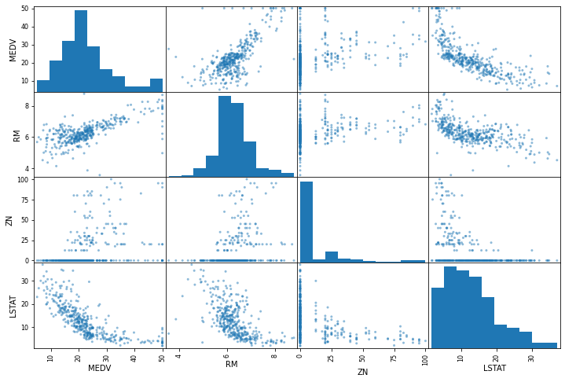
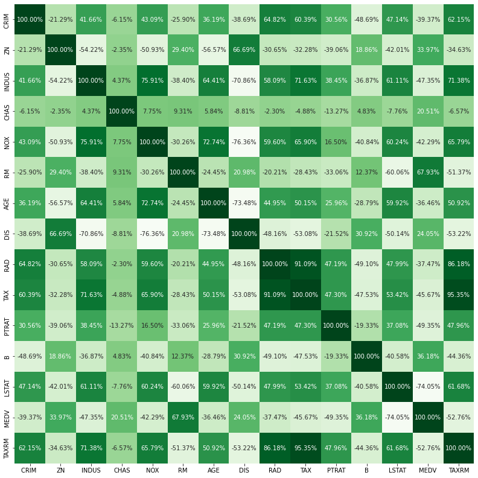
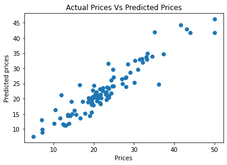

# DS-Project-1
Engineered a model that estimates and predicts the price for Real Estate

* Designed a model that estimates the prices of real estate (Median value of owner-occupied homes in $1000’s) to optimize future real estate purchases (minimizing losses) as housing prices are an important reflection of the economy, and housing price ranges are of great interest for both buyers and sellers.
* Dataset - Scraped and fetched data from the UCI ML Repository for the model. The Dataset includes various features describing the housing situation in Boston such as Number of Rooms, Crime Rate, Tax ,etc.
* Model - The major aim of in this project is to predict the house prices based on the features using some of the regression techniques and algorithms. Optimized Linear, DecisionTree and Random Forest Regressors using GridsearchCV to reach the best model.

## Code and Resources Used ##
**Python Version:** 3.10.5  
**Packages:** pandas, numpy, sklearn, matplotlib, seaborn  
**For Web Framework Requirements:** _pip install -r requirements.txt_  
**Data Resources:** <https://archive.ics.uci.edu/ml/machine-learning-databases/housing/>

## About the Dataset ##
Housing prices are an important reflection of the economy, and housing price ranges are of great interest for both buyers and sellers. In this project, house prices will be predicted given relatable features that cover many aspects of residential houses. The Goal is to train a model that can further estimate and give us accurate real estate price predictions
#### Data Overview ####

1. **CRIM** per capital crime rate by town  

2. **ZN** proportion of residential land zoned for lots over 25,000 sq.ft.  

3. **INDUS** proportion of non-retail business acres per town  

4. **CHAS** Charles River dummy variable (= 1 if tract bounds river; 0 otherwise)  

5. **NOX** nitric oxides concentration (parts per 10 million)  

6. **RM** average number of rooms per dwelling  

7. **AGE** proportion of owner-occupied units built prior to 1940  

8. **DIS** weighted distances to five Boston employment centers  

9. **RAD** index of accessibility to radial highways  

10. **TAX** full-value property-tax rate per 10,000 USD  

11. **PTRATIO** pupil-teacher ratio by town  

12. **Black** 1000(Bk — 0.63)² where Bk is the proportion of blacks by town  

13. **LSTAT** % lower status of the population  

14. **MEDV** Median value of owner-occupied homes in $1000’s

## EDA - Exploratory data analysis ## 
I looked at the distributions of the data and the value counts for the various categorical variables. I also plotted graphs and heatmaps for correlations between the features and label. Below are a few highlights.

## Model Building ##
I also split the data into train and tests sets with a test size of 20%.

I tried three different models and evaluated them using Mean Absolute Error. I chose MAE because it is relatively easy to interpret and outliers aren’t particularly bad in for this type of model.

I tried three different models:

Multiple Linear Regression – Baseline for the model
DecisionTree Regression – Because of the sparse data from the many categorical variables, I thought a normalized regression like DecisionTree would be effective.
Random Forest – Again, with the sparsity associated with the data, I thought that this would be a good fit.

## Model Performance ##
The Random Forest Regression model outperformed the other approaches on the test and validation sets.I found out the Mean and the Standard Deviation for all the three models. This basically gives us an image by how much percentage can the predictions be off the actual prediction.
* **Multiple Linear Regression:**   Mean- 5.028337074958086 , Standard Deviation- 1.056869119278954
* **Decision Tree Regression:** Mean- 4.256820741921791,
   Standard Deviation- 1.1575140416039331
* **Random Forest Regression:** Mean- 3.304827981052571, 
   Standard Deviation- 0.6490112395533792  
The results were pretty good since in the worst case scenario,our predictions would only be off by a meager 3.65%.

